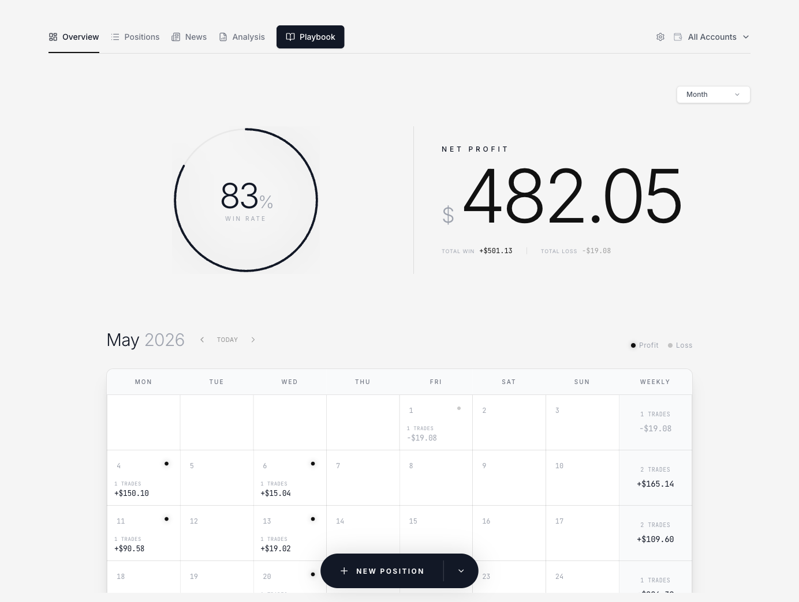

# LucrJournal

[中文](README_ZH.md)

LucrJournal is an Obsidian plugin that keeps your trading journal inside the vault you already use. Every position, account, symbol, key level, news item, analysis, and playbook lives as plain Markdown — searchable, linkable, and yours.



## Why keep the journal in Obsidian

- Records stay in your vault. No cloud, no lock-in: the files are yours to read, back up, and link however you like.
- A trade is more than a note. Positions link to their account, symbol, key levels, news, market analysis, and playbook, so a review can trace one trade back to the plan and evidence behind it.
- Built for review, not just entry. Dashboards, filters, and playbook statistics turn closed trades into reusable checks.

## Features

- **Position records** — open/close lifecycle with entry, exit, stop, target, and notes; notional, risk, P&L, and R:R derived per instrument type (crypto, futures, CFD).
- **Context sections** — `News`, `Key Levels`, `Confluence`, and `Market Analysis` linked right inside each position.
- **Playbooks & criteria** — structured checklists written back to Markdown, with win rate and net P&L computed from the positions that actually used them.
- **Evidence & OCR** — paste or drop screenshots as deduplicated attachments; local OCR recognizes MetaTrader and TradingView screenshots and lets you review the result before it touches the record.
- **Charts** — candlestick charts with entry/exit markers; futures data comes from Yahoo, crypto from your account's exchange (Binance, Bybit, OKX).
- **Symbols** — built-in catalog (ES, NQ, EURUSD, XAUUSD…), canonical naming, TradingView-backed logos and types.
- **Templates, release notes, English and 简体中文 UI** — plus an upgrade gate tied to your LucrTrade account.

## Install

LucrJournal is listed in the Obsidian community plugin store (id: `lucrjournal`).

1. Settings → Community plugins → Browse → search **LucrJournal** → Install → Enable.
2. Run the `Open journal` command and sign in with your LucrTrade account. If your plan does not include journal access, the upgrade screen shows how to enable it — no re-login needed afterwards.

Requires Obsidian 1.11.4 or later. For a manual install, copy `manifest.json`, `main.js`, `styles.css`, `onnxruntime-web/`, and `ocr/` into `VaultFolder/.obsidian/plugins/lucrjournal/` and reload Obsidian.

## Documentation

Guides, field reference, and FAQs: <https://lucrjournal.lucrtrade.com/docs/>

## Development

```bash
bun install
bun run dev
bun run build:bundle
bun run test
bun run lint
```

## License

MIT
