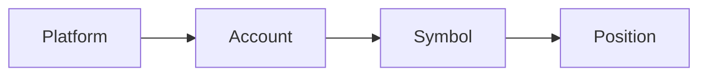

## How the four objects connect

Platforms, accounts, symbols, and positions form the four-level relationship that LucrJournal uses to organize trading records. A platform represents the trading source. An account defines an independent scope. A symbol stores the instrument rules for one account. A position then references that symbol.



This chain matters. It keeps instruments with the same name independent across accounts. It also gives LucrJournal one place to determine which account owns a position.

For example, you can have two accounts named "Binance Live" and "Binance Practice." Both can store `BTCUSDT`, but they use different symbol files. Their positions, fees, and statistics do not mix just because the code is the same.

## Platform

A platform is the trading source used by an account. It gives the account a platform name and icon. It is also the default account name when `Display Name` is empty.

Platforms matter because multiple accounts can use the same platform. LucrJournal includes Binance, Bybit, OKX, Bitget, MetaTrader, and Interactive Brokers. You can also enter another name to create your own platform record.

For example, "Binance Live" and "Binance Practice" can both link to Binance. They share a platform identity but remain separate accounts.

A platform is directly related to accounts. If you enter a platform name that has not been saved when creating an account, the plugin creates the platform first and then the account. When you delete an account, the platform file is included only if that account is its sole user.

## Account

An account is the ownership scope for one independent set of trading records. It uses `Account Name` to distinguish platforms, funding sources, or purposes.

Accounts matter because symbols are not shared globally. Each symbol belongs to one account. The account uses these symbols to aggregate its `Symbols` and `Positions` counts.

For example, you can name real-money trading "IB Live" and simulated trading "IB Practice." Even if both trade `ES`, LucrJournal keeps their statistics separate.

An account is related to a platform and symbols. It directly links to a platform and owns a set of symbols. A position does not use an account field as its current source of ownership. It finds the account through its symbol.

## Symbol

A symbol is a tradable instrument record ==under one specific account==. It stores more than a code. It also defines calculation semantics such as `Type`, `Fee`, and `Contract Unit`.

Symbols matter because identical codes do not guarantee identical trading terms. Different accounts can use different fee rates and must keep separate position relationships.

For example, adding `BTCUSDT` to two accounts creates two separate records:

```text
SBL-Binance Live-BTCUSDT.md
SBL-Binance Practice-BTCUSDT.md
```

The files have the same code but different account links. Positions in each account can reference the corresponding file.

A symbol is directly related to an account and positions. The symbol stores the account link, and each position stores a symbol link. See [[symbol-types]] for how type affects calculations.

## Position

A position records one specific trade. It stores the side, time, prices, quantity, risk, result, and review context. A separate file such as `POS-00001.md` gives it an identity.

Positions matter because lists, calendars, context performance, and playbook statistics all use individual positions as samples.

For example, a `BTCUSDT` position in "Binance Live" links only to the `BTCUSDT` symbol under that account. LucrJournal finds the symbol from the position, then finds "Binance Live" and Binance from the symbol.

A position is directly related to a symbol. It can also link to News, Key Levels, Market Analysis, Confluence, and playbooks. See [[position-lifecycle]] for its actual stages.

## Why positions do not link directly to accounts

A position finds its account through its symbol so that ownership and calculation rules follow the same relationship chain.

1. The symbol already stores its account.
2. The symbol also stores its type, fee, and contract unit.
3. By referencing one symbol record, a position gets both account ownership and calculation semantics.

When LucrJournal determines the current account and platform, it only uses the symbol linked by the position. Even if the position file still contains old account or platform fields, LucrJournal does not treat them as current relationships.

> [!NOTE]
> If the position's symbol link is missing or broken, LucrJournal cannot derive its account or platform. The position file may still exist, but its relationship statistics are incomplete.

## What renaming and deletion affect

Renaming an account changes more than one line of text. The plugin updates these items in order:

1. The account name, account file path, and existing document title.
2. The account links and file paths of every symbol under that account.
3. The symbol links in every related position.

%% ![[screenshot-accounts-rename-cascade.png]] %%

> [!WARNING]
> An account rename writes linked files one by one and has no automatic rollback. Back up the vault before renaming, and do not close Obsidian during the rename. After a failure, verify that accounts, symbols, and positions can still find one another along the same chain.

Deleting an account has a wider scope. The plugin moves all linked positions to the trash first, then all symbols and the account file. It moves the platform file only if it decides that the account is the sole user of that platform.

> [!WARNING]
> `Delete Account?` removes the entire downstream relationship, not only the account file. Before confirming, check `Symbols ({count})`, `Positions ({count})`, and any `Platform File (sole account)` shown in the window. Platform names that differ only by letter case may not be recognized as shared. If a platform file appears, verify the other accounts again.

Deleting a position directly moves only that position file to the trash. It does not delete the account, symbol, or context. Deleting a symbol directly moves all positions that reference it to the trash first, then moves the symbol file.

## Continue reading

- [[accounts-and-symbols]]: Create and manage accounts and symbols.
- [[symbol-types]]: Understand the calculation differences between the four symbol types.
- [[position-lifecycle]]: Understand how position fields change from creation through review.
