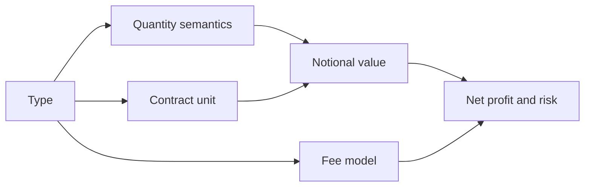

## A type is a set of calculation rules

A symbol type tells LucrJournal how to interpret quantity, contract unit, and fees. It is not only a label for filtering.

Type matters because the same number means different things under different types. `2` can mean two units of a native asset, two contracts, or two lots. The plugin uses the type to calculate notional value and fees, then passes those results to the position's risk and profit formulas.

This means ==numbers can still appear when the wrong type is selected, but they may not use the rules you expect==.

![[screenshot-settings-symbols.png]]

## Crypto Spot

`Crypto Spot` records quantity in native asset units. Its contract unit is fixed at 1 and cannot be edited.

This type matters because `Amount` and `Entry Price` determine notional value. `Fee` is then calculated as a percentage of notional value.

For example, in `Native` mode, 0.5 ETH at an entry price of 2,000 has a notional value of 1,000. With a 0.1% fee rate, the fee is 1.

It is related to the position's `Amount`, `Entry Price`, `Notional Value`, and `Fee`. Code shapes are usually `BTCUSDT` or `DOGE/USDT`.

## Crypto Perpetual

`Crypto Perpetual` is the type the plugin uses for crypto perpetual code shapes. Its contract unit is also fixed at 1.

This type matters because it classifies the code as a perpetual. Its current quantity, notional value, and fee formulas are the same as `Crypto Spot`: native asset quantity multiplied by entry price gives notional value, and the fee is a percentage of notional value.

For example, 0.02 BTC at an entry price of 60,000 has a notional value of 1,200. With a 0.05% fee rate, the fee is 0.6.

It is related to normalized codes ending in `.P`, the position's `Amount`, and percentage fees. `BTC/USDT:USDT`, `BTCUSDT_PERP`, and `BTCUSDT.NEXT` are all normalized to `BTCUSDT.P`.

## Future

`Future` records quantity as a number of contracts. A position uses `Contract`, which only accepts integers from 1 through 20. The contract unit comes from the plugin's built-in table and cannot be overridden by the symbol file.

This type matters because notional value is calculated as "contracts × entry price × contract unit." `Fee` is calculated per contract instead of as a percentage of notional value.

For example, the built-in contract unit for `MES` is 5. With 2 contracts and an entry price of 5,000, the notional value is 50,000. If the fee is 1.25 per contract, the total fee is 2.5.

It is related to the position's `Contract`, the symbol's built-in `Contract Unit`, and per-contract fees. Built-in codes such as `ES`, `MES`, and `NQ` are recognized directly as futures.

> [!NOTE]
> LucrJournal can calculate notional value for a future only when it can resolve a built-in contract unit. Manually changing an unlisted code to `Future` does not create a contract unit for it.

## CFD

`CFD` records quantity in lots. A position uses `Lots`, with a range from 0.01 through 20. The contract unit comes from the built-in table, but you can change it on the symbol to an integer greater than 0.

This type matters because notional value is calculated as "lots × entry price × contract unit." `Fee` is calculated per lot.

For example, the built-in contract unit for `XAUUSD` is 100. With 0.1 lots and an entry price of 2,300, the notional value is 23,000. If the fee is 3 per lot, the total fee is 0.3.

It is related to the position's `Lots`, the symbol's `Contract Unit`, and per-lot fees. `XAUUSD`, `EURUSD`, and several index codes have built-in contract units.

## What happens when you select the wrong type?

| Selected type | How the plugin interprets quantity | How fees are calculated | Common result |
| --- | --- | --- | --- |
| Crypto Spot | Native asset quantity | Percentage of notional value | A futures or CFD multiplier is ignored. |
| Crypto Perpetual | Native asset quantity | Percentage of notional value | A missing type also silently uses these rules. |
| Future | 1–20 integer contracts | Per contract | Notional value may not be derived without a built-in contract unit. |
| CFD | 0.01–20 lots | Per lot | A wrong contract unit multiplies or divides notional value by the same factor. |

Notional value is also used to calculate net profit and risk. Selecting the wrong type does more than mislabel one field. It carries the error into the position result.

> [!WARNING]
> The meaning of a `Fee` value also changes with the type. For crypto types, enter a percentage. For `Future`, enter an amount per contract. For `CFD`, enter an amount per lot. All three models reject 0. Leave the value empty when there is no fee.

## How automatic inference works

The plugin normalizes the code first, then checks these rules in order:

1. Match a built-in code first. `ES` is recognized as `Future`. `XAUUSD+` is normalized to `XAUUSD` and recognized as `CFD`.
2. Infer recognizable perpetual code shapes as `Crypto Perpetual` and normalize them to an ending of `.P`.
3. Infer other explicit trading pairs and compact codes made from known quote assets as `Crypto Spot`.
4. Split any remaining six-letter uppercase code into its first and last three letters, then infer `Crypto Spot`.
5. Leave the type empty when the code cannot be recognized as a pair. Position calculations then fall back to the `Crypto Perpetual` model.

| Input | Saved name | Inferred type |
| --- | --- | --- |
| `DOGE/USDT` | `DOGEUSDT` | `Crypto Spot` |
| `BTCUSDT_PERP` | `BTCUSDT.P` | `Crypto Perpetual` |
| `FOO/BAR` | `FOO/BAR` | `Crypto Spot` |
| `ABCDEF` | `ABCDEF` | `Crypto Spot` |

> [!WARNING]
> Any six-letter uppercase code not found in the built-in table is treated as `Crypto Spot`, even if it is not a real trading pair. Automatic inference does not show an extra error for this result.

> [!WARNING]
> When the type is empty, missing, or unrecognized, position semantics silently fall back to `Crypto Perpetual`. After adding a symbol, verify `Type`, `Fee`, and `Contract Unit` under `Symbols`. Do not check only the code.

## Relationship to other concepts

The symbol type belongs to one symbol record under one account. The same code in two accounts creates two symbols, so each can store its own type and fee rate. See [[account-symbol-position]] for the complete relationship.

Type determines a position's quantity field and derived calculations, but it does not fill in every input. See [[position-lifecycle]] for which fields matter during opening, closing, and review.
