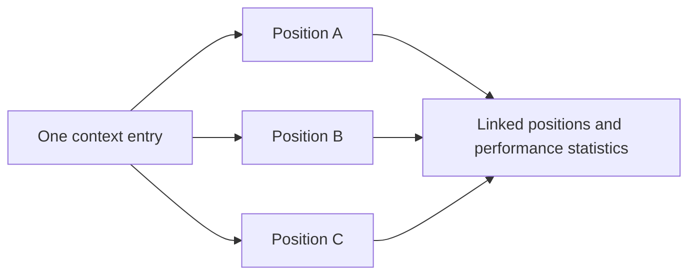

## What is context?

Context is an independent record that multiple positions can reuse. News, Key Levels, Market Analysis, and Confluence are all context. A position's `Notes` belong only to that trade.

Context matters because one event, price area, or market view can affect several trades. Once it is saved separately, LucrJournal can find linked positions from the context and aggregate their performance.

For example, if one interest-rate decision affects three positions, create one News entry and link all three positions to it. You do not need to copy the event description three times.

Context is related to positions, playbooks, and review statistics. Positions store links, context keeps reusable content, and statistics follow the links back to the positions.

## When to save context separately

The question is not how long the content is. Ask whether it has its own identity and whether you will reuse it.

| Content | Where to put it | Reason |
| --- | --- | --- |
| Why you entered this trade | The current position's `Notes` | It explains only this trade. |
| What happened while you executed this trade | The current position's `Notes` | It belongs to one execution. |
| One event affected several trades | News | The event needs to be reused. |
| One price area is watched repeatedly | Key Level | The price area has its own identity. |
| One market view will guide later trades | Market Analysis | The view spans several positions. |
| One set of conditions appears repeatedly | Confluence | The condition set needs to link to playbooks and positions. |

> [!TIP]
> If the content has appeared only once and you do not know whether you will reuse it, put it in the position's `Notes` first. The second time you need it, turn the stable part into separate context.

## News

News is an event record with its own name, optional source, and body. Use it for external information that affects more than one position.

News matters because you do not need to copy the same event into every position. Its source can also stay in one record.

For example, save "U.S. CPI 2026-07" as News, then link the day's index, gold, and foreign exchange positions to it. Each position still uses `Notes` to record how that trade responded to the news.

News is related to the News section in a position and the `Positions` statistic. When you create News from a position by entering only a name, the plugin leaves the source empty and creates an empty body for you to complete later.

## Key Level

A Key Level is a price area that multiple positions can reuse. It tells you which trades watched the same area. It does not explain the execution details of one trade.

Key Levels matter because the same area can affect several trades over time and in different directions. Once the area is saved separately, you can review every position that formed around it.

For example, save "Nasdaq previous high 21,500" as a Key Level. Record the first breakout and a later retest as separate positions, then link both to that level.

A Key Level is related to the Key Levels section in a position and backlink performance statistics. When you create one from a position by entering only a name, `Description` is empty by default.

## Market Analysis

Market Analysis is a market view that you can continue to reference. It stores your conclusion about structure, trend, or environment. It is not the entry reason for one position.

Market Analysis matters because one view can affect several trades over a number of days. Saving the view separately lets you compare it with later results.

For example, save "A stronger U.S. dollar is pressuring risk assets" as Market Analysis. Link the positions influenced by that view during the period. Each position still records its execution differences in `Notes`.

Market Analysis is related to the Market Analysis section in a position and backlink performance statistics. When you create one from a position by entering only a name, `Description` is empty by default.

## Confluence

Confluence is a reusable group of conditions that appear together. It gives the combination a name so positions and playbooks can reference it.

Confluence matters because one condition is often not enough to describe a trade pattern. Once a combination has its own identity, you can compare its performance across positions.

For example, save "Retest of a weekly key level + aligned with the trend + volume confirmation" as one Confluence. Add it to a criteria group in a playbook and link it to actual positions.

Confluence is related to criteria, playbooks, and positions. It also has two visibility scopes:

- A Confluence created from a position is `Public` by default. It appears in the Confluence list and can be selected by positions without a linked playbook.
- A Confluence created automatically when a playbook is saved is private. It does not appear in the public list, but you can still use it in a playbook.
- After a position links to a playbook, it can see private Confluences referenced by that playbook.
- When a playbook selects a Confluence, it can see both public and private entries.

%% ![[screenshot-context-confluence-visibility.png]] %%

> [!NOTE]
> Visibility only controls which selection lists show the entry. It is not an access permission for position content. It separates general Confluences from those used inside a specific playbook.

## How backlink statistics are calculated

Backlink statistics are results that LucrJournal derives from real file links. They let you look from one context entry back to its linked positions. They are not manually entered summaries.

These statistics matter because linked counts and performance samples use different rules:

- `Positions` and `Trades` include every position that resolves a link to this context, including open positions.
- `Win Rate`, `Net Profit`, `Largest Profit`, and `Largest Loss` use only closed positions whose net profit is a nonzero number.
- When no positions match the performance rules, win rate is 0, and largest profit and largest loss have no value.

For example, one Market Analysis entry links to five positions. Two remain open. One is closed with a net profit of 0. The other two are closed with nonzero net profit. The page reports five trades, but only the last two positions determine win rate and profit or loss performance.

Playbook performance uses the same rules. A position counts as closed when either `Status` or `Closed At` marks it as closed. See [[position-lifecycle]].

## Removing a link and deleting the original entry

Using `Remove` on context in a position removes only the link from the current position. It does not delete the original context file or affect other positions.

Deleting the original context under `Analysis` is different. The plugin first removes links to it from every related position, then moves the source file to the trash.

> [!WARNING]
> When you delete a Confluence, the plugin does not update playbook bodies. A playbook that still references it may keep a broken link. Before deleting, check whether any playbook still uses it.

## Continue reading

- [[position-details]]: Add and remove context in one position.
- [[playbooks-and-criteria]]: Understand the relationship between playbooks, criteria, and Confluence.
- [[dashboard-review]]: Review trading performance through backlink statistics.
