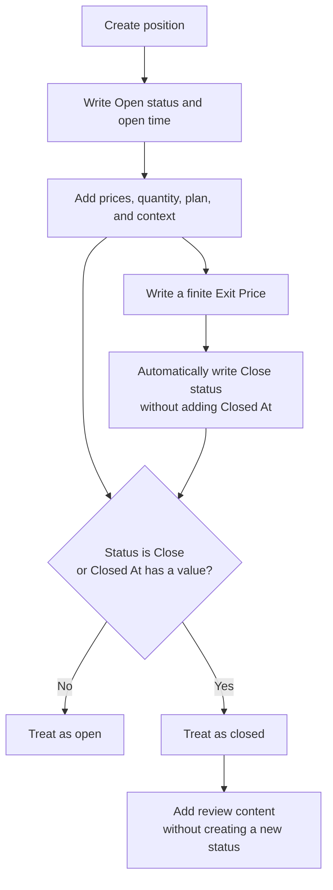

## The lifecycle is not one state machine

A position's actual stage comes from the combination of `Status`, `Opened At`, `Closed At`, `Exit Price`, and other fields. One enum does not control the complete lifecycle.

This matters because LucrJournal lets these fields be empty independently and lets them be temporarily inconsistent. To decide whether a position is closed, the system checks only two conditions: `Status` is `Close`, or `Closed At` has a value. Either condition makes the position closed.

For example, when you enter an `Exit Price`, the plugin changes `Status` to `Close` but does not fill in `Closed At`. The position already counts as closed, but its duration still has no end time.

## Creation stage

The creation stage is when `Save Position` first writes the position file. The normal creation flow writes:

- `Status` as `Open`.
- `Opened At` as the current time in your configured timezone.
- The `Side` selected during creation.
- Empty `Confidence`, `Notional Value`, `Risk`, and `Fee` values.
- An initial `Net PnL` of 0.
- An empty `Notes` section.

These empty values matter. They mean the information is incomplete. They do not mean the plugin has calculated a result of 0.

For example, you can choose only an account, a symbol, and `LONG`, then save the position. It already has a stable identity and open time. You can add prices, quantity, and the plan later.

The creation stage is directly related to accounts and symbols. The plugin first confirms that the account exists, then ensures that the symbol exists under that account, and finally links the position to the symbol. See [[account-symbol-position]] for the complete relationship.

> [!NOTE]
> You cannot change `Side` after creation. The plugin rejects an entire update whenever it includes Side. If you selected the wrong side during creation, create a new position record with the correct side.

## Open stage

The position is in the open stage while it does not meet the rule "Status is Close or Closed At has a value." Execution facts, position size, and the trade plan matter most during this stage.

| Field | Meaning during this stage | Related result |
| --- | --- | --- |
| `Symbol` | Determines account ownership, type, fee, and contract unit. | Quantity semantics, notional value, fee. |
| `Side` | Determines the positive or negative direction of a price move. | Risk, Planned R:R, Real R:R, net profit. |
| `Entry Price` | The only entry price used by formulas. | Notional value, risk, and result. |
| `Amount`, `Contract`, or `Lots` | Represents position size according to the symbol type. | Notional value. |
| `Stop Loss` | Represents the planned adverse price distance. | Risk, Planned R:R, Real R:R. |
| `Target Price` | Represents the planned favorable price distance. | Planned R:R. |
| `Confidence` | Stores your subjective score for the trade. | Review filtering; it does not change formulas. |

For example, after you add an entry price, quantity, and stop loss to a `LONG` position, the plugin can derive notional value and risk. It can derive Planned R:R only after you also add a target price. If a required input is missing, the related result has no reliable meaning.

These fields are directly related to the symbol type. `Amount`, `Contract`, and `Lots` are not interchangeable. See [[symbol-types]].

## Closed stage

The position is in the closed stage once LucrJournal decides that it has ended. The condition is `Status` set to `Close`, or any value in `Closed At`.

Closing matters because backlink statistics use it as the first condition for a performance sample. Open positions do not enter calculations for win rate, net profit, largest profit, or largest loss.

When you write an `Exit Price` that can be converted to a finite number, the plugin automatically sets `Status` to `Close` but does not add `Closed At`. In the other direction, entering only `Closed At` is enough to make the position closed even if `Status` is still `Open`.

> [!WARNING]
> `Exit Price`, `Status`, and `Closed At` are not forced to stay in sync. An exit price of 0 or a negative value also closes the position. Clearing the exit price does not reopen it automatically. After closing a position, verify all three fields.

Different results need different inputs after closing:

- `Net PnL` needs Side, Entry Price, Exit Price, and Notional Value, then subtracts Fee. The formula uses one entry price and does not calculate an average entry price.
- `Real R:R` needs Side, Entry Price, Exit Price, and Stop Loss. It recalculates from source fields. It does not read the saved net profit or risk, and it does not include fees.
- `Duration` needs Opened At and Closed At. Status or Exit Price alone cannot produce a complete duration.

For example, a `LONG` position has an entry price of 100, a notional value of 1,000, an exit price of 110, and a fee of 2. Its net profit is 98. With a stop loss of 95, Real R:R is 2. The fee that reduces net profit to 98 does not change this R:R.

The closed stage is related to context and playbook statistics. Closing is not enough by itself. Net profit must also be a nonzero number before the position enters these backlink performance metrics. See [[context-notes#How backlink statistics are calculated]] for the exact rules.

## Reopening a position

Reopening means explicitly changing `Status` back to `Open`. If the same update does not also provide `Closed At`, the plugin clears the previous close time.

This matters because clearing `Exit Price` by itself does not reopen a position. In the other direction, changing only the status does not automatically clear an old exit price.

For example, after entering an exit price by mistake, you can clear the exit price, but the status may remain closed. Explicitly changing the status back to Open clears Closed At when the same update does not include a close time. Whether the old exit price remains depends on whether you cleared it separately.

Reopening is related to `Status`, `Closed At`, and `Exit Price`. It does not change the fixed Side selected during creation, and it does not create a new position record.

## Completing the review

A completed review is a level of content completeness. It is not a third LucrJournal position status. The plugin has only Open and Close values. It has no "reviewed" status.

This boundary matters because completing `Confidence`, `Notes`, News, Key Levels, Market Analysis, Confluence, or a playbook does not trigger a new lifecycle transition. You decide whether the record answers your review questions well enough to be complete.

For example, after a closed position includes its execution facts, screenshots, original notes, related context, and playbook, you can consider the review complete. The system still treats it only as a closed position.

The review stage is related to [[context-notes]], [[attachments-chart-ocr]], and [[playbooks-and-criteria]]. These records add the "why" and "what I learned." They do not change whether the position is open or closed.

%% ![[screenshot-position-lifecycle-review.png]] %%

## Update boundaries for derived values

Notional Value, Fee, Net PnL, and Risk are derived values recalculated from source fields. When you change related prices, quantity, or the symbol, the plugin tries to update them from the current inputs. If you edit a derived value directly, the manual result remains until a later source-field change overwrites it.

> [!WARNING]
> If you clear or invalidate an input such as quantity, Entry Price, or Contract Unit and the formula cannot produce a new result, the old Notional Value is not cleared automatically. If the symbol fee is cleared, invalid, or calculates to 0, an old Fee may continue to affect Net PnL. After removing source data, verify `Notional Value`, `Fee`, `Net PnL`, and `Risk` again.

## Deletion is not a lifecycle state

Deleting a position moves the current position file to the trash. It is not a close or review transition. The account, symbol, playbook, and context files are not removed with this direct deletion.

> [!WARNING]
> Deleting a position directly does not remove attachments used only by that position. They can remain in the vault without a position reference. If you need to keep statistics or evidence, do not use deletion as a way to "finish" a review.

## Continue reading

- [[record-first-position]]: Create a complete position.
- [[position-details]]: Complete execution, time, risk, and context.
- [[review-workflow]]: Turn closed records into reusable conclusions.
