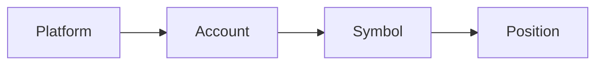

## What are accounts and symbols?

An account represents one independent set of trading sources. A symbol is a tradable instrument recorded under one account. A position finds its account through its symbol.

The same symbol can exist separately in different accounts. This keeps live and practice accounts, different platforms, and different funding sources from being mixed together.

## Create an account

After the first sign-in, LucrJournal opens `New Account` directly if the current vault has no accounts. If accounts already exist, select `New Account` in the account selector in the header. You can also select the gear icon, open `Accounts`, and select `Add Account`.

1. Choose or enter a platform under `Platform`.
2. Enter an account name under `Display Name`. You can leave it empty to use the platform name by default.
3. Select `Create`.

If you enter a new platform, the plugin creates a platform file with that name before it creates the account file.

> [!TIP]
> Use a `Display Name` that you will still recognize later. Different accounts cannot use the same display name.

## Manage accounts

Select the gear icon on the right side of the header, then open `Accounts`. The list shows `Platform`, `Account Name`, `Symbols`, `Positions`, and `Actions`.

%% ![[screenshot-settings-accounts.png]] %%

- Select an `Account Name` to change the display name.
- Select `Symbols` to view the symbols in that account.
- Select `Positions` to view the positions in that account.
- Use `Actions` to delete the account.

Renaming an account updates the account file, every symbol file under that account, and the symbol references in positions.

> [!WARNING]
> An account rename writes linked files one by one and has no automatic rollback. Back up the vault before renaming, and do not close Obsidian during the rename. If it fails, check that the account, symbols, and positions still point to one another correctly.

> [!WARNING]
> `Delete Account?` moves the account, all its symbols, and linked positions to the trash. The confirmation lists `Account File`, `Symbols ({count})`, `Positions ({count})`, and sometimes `Platform File (sole account)`. If you need to keep these records, do not select `Confirm Delete`.

> [!WARNING]
> When multiple accounts share a custom platform, platform names that differ only by letter case may be mistaken as not shared. If the confirmation shows `Platform File (sole account)`, first confirm that no other account uses the same platform. Cancel the deletion if you are unsure.

## Add a symbol

A symbol is a tradable instrument under an account. It also provides the rules used to calculate position quantity, notional value, and fees.

%% ![[screenshot-settings-symbols.png]] %%

1. Select the gear icon on the right side of the header.
2. Open `Symbols`.
3. Select `Add Symbol`.
4. Choose an existing account under `Account`.
5. Enter the instrument code under `Symbol`.
6. Select `Add Symbol`.

You cannot create two symbols with the same normalized name under one account. Different accounts can each have a symbol with the same name.

## Symbol names are normalized

Leading and trailing spaces are removed from symbol names, and letters are converted to uppercase. Common inputs are saved with stable names:

| Input | Saved result | Inferred type |
| --- | --- | --- |
| `DOGE/USDT` | `DOGEUSDT` | `Crypto Spot` |
| `BTC/USDT:USDT` | `BTCUSDT.P` | `Crypto Perpetual` |
| `ES` | `ES` | `Future` |
| `XAUUSD+` | `XAUUSD` | `CFD` |

For spot, you can enter `BTCUSDT` or `BTC/USDT`. For perpetuals, enter `BTCUSDT.P` or `BTC/USDT:USDT`. For futures, enter `ES`. For CFDs, enter `XAUUSD`.

> [!WARNING]
> Any unrecognized six-letter uppercase code is inferred as `Crypto Spot`. If `Type` is empty, missing, or unrecognized, position calculations also default to the `Crypto Perpetual` rules. Always verify `Type` in the `Symbols` list after adding a symbol.

## Verify type, fee, and contract unit

The `Type`, `Fee`, and `Contract Unit` values in the `Symbols` list affect position calculations.

- `Crypto Spot` and `Crypto Perpetual` use a fixed contract unit of 1. `Fee` is calculated as a percentage of notional value.
- `Future` uses a built-in contract unit. `Fee` is calculated per contract.
- `CFD` uses a built-in or manually entered positive integer contract unit. `Fee` is calculated per lot.

Select `Type` to correct an inference result. You can also edit `Fee` and any editable `Contract Unit` directly in the list.

> [!WARNING]
> A `Fee` of 0 is rejected when saved. Leave it empty if there is no fee. A fee entered for a `Future` or `CFD` cannot be less than 0.0001.

## Check linked positions before deleting a symbol

When you delete a symbol under `Actions` in the `Symbols` list, the confirmation shows `Delete Symbol?` and lists `Symbol File` and `Positions ({count})`.

> [!WARNING]
> Selecting `Confirm Delete` moves every position linked to the symbol to the trash first, then moves the symbol file. Position attachments are not removed with the positions, so files without a position reference may remain.

## Where are the files saved?

- Accounts are saved in `LucrJournal/accounts/ACC-{Account Name}.md`.
- Symbols are saved in `LucrJournal/symbols/SBL-{Account Name}-{Normalized Symbol}.md`.

LucrJournal uses file names to establish relationships between objects. Do not manually rename these files to duplicate names, and do not remove account or symbol information from their file names.

## Next step

Continue to [[record-first-position]] and create a complete position record with the account and symbol you prepared.
