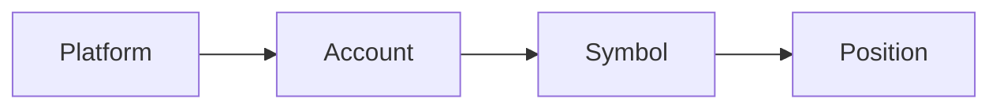

## What is LucrJournal?

LucrJournal is a local trading journal that runs inside Obsidian. It connects accounts, symbols, positions, news, analysis, and playbooks. This lets you trace a trade back to its plan, evidence, and review conclusions.

You enter the main interface through `Open journal`. Records created by the plugin stay in the `LucrJournal/` folder of the current vault. They remain Markdown files that you can search, link, and manage.

![[screenshot-overview.png]]

## Who is it for?

LucrJournal is for people who record trades consistently and want to answer questions like these:

- Which account and symbol does this position belong to?
- Why did I choose `LONG` or `SHORT` when I opened it?
- What were the actual risk, return, and fees?
- Which news, analysis, key levels, or playbooks affected the result?
- Which practices should I keep, and which mistakes keep repeating?

LucrJournal is not the right starting point if you do not use Obsidian or only want order entry and market data tools. It records and reviews trades. It does not execute trades or choose a direction for you.

## Meet the four objects first

- A platform represents the trading source.
- An account separates different purposes or sources of funds.
- A symbol is a tradable instrument recorded under one account.
- A position records one specific `Open`, holding, and `Close` process.

The same symbol can exist separately in different accounts. A position finds its account through its symbol. Before you create your first position, you need at least one account and one symbol.

## What to know before the first launch

All LucrJournal views require a valid sign-in and LucrJournal access. The first time you run `Open journal`, you will see `Sign in` instead of `Overview`.

Authorization happens in your browser. You then return to Obsidian for an access check. If your account does not have access yet, the interface shows `Upgrade to LucrJournal`. After upgrading, select `I've upgraded — check again`. You do not need to sign in again.

> [!INFO]
> Sign-in only verifies your identity and access. Your trading records remain in the current vault.

## Recommended reading path

1. [[quickstart]]: Sign in, check access, and save your first position.
2. [[accounts-and-symbols]]: Understand accounts, platforms, symbols, and deletion effects.
3. [[record-first-position]]: Fill in your first complete position record field by field.
4. [[position-details]]: Add prices, risk, return, notes, and context.
5. [[dashboard-review]]: Start reviewing from `Overview` and `Positions`.
6. [[playbooks-and-criteria]]: Turn recurring sources of edge into playbooks.

## How to use the six sections

| Section | When to read it |
| --- | --- |
| Getting Started | Sign in for the first time and prepare accounts and symbols. |
| Core Model | Understand the relationships between context and files. |
| Position Records | Create and complete positions, recognize screenshots, or reuse position templates. |
| Review & Playbooks | Review results and maintain playbooks and criteria. |
| Data & Settings | Handle imports, local files, language, timezone, and preferences. |
| Q&A | Get a quick answer to a specific question. |

> [!TIP]
> On day one, complete one position that you can review later. Record the facts first, add evidence and context next, then turn the conclusion into a playbook.
