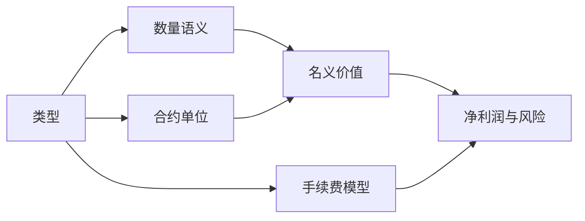

## 类型是一组计算规则

标的类型是 LucrJournal 对数量、合约单位和手续费的解释方式。它不是只用于筛选的标签。

类型重要，是因为同样的数字在不同类型下含义不同。`2` 可以表示 2 个原生资产、2 张合约或 2 手；插件据此计算不同的名义价值和手续费，再把结果交给仓位的风险与收益公式。

因此，==类型选错时，后面的数字即使能显示，也可能不是你以为的口径==。

%% ![[screenshot-symbols-type-fields.png]] %%

## 加密货币现货

`加密货币现货` 是按原生资产数量记录的标的类型。它的合约单位固定为 1，不能编辑。

这个类型重要，是因为 `数量` 与 `入场价` 共同决定名义价值，`手续费` 则按名义价值的百分比计算。

例如，在 `原生资产` 模式下记录 0.5 个 ETH，入场价为 2,000，名义价值就是 1,000。手续费设为 0.1% 时，手续费是 1。

它与仓位的 `数量`、`入场价`、`名义价值` 和 `手续费` 相关。代码形状通常是 `BTCUSDT` 或 `DOGE/USDT`。

## 加密货币合约

`加密货币合约` 是插件用于加密货币永续类代码的类型。它的合约单位同样固定为 1。

这个类型重要，是因为它决定代码按合约形状归类，但当前的数量、名义价值和手续费公式与 `加密货币现货` 相同：原生资产数量乘入场价得到名义价值，手续费按名义价值百分比计算。

例如，0.02 个 BTC 的入场价为 60,000，名义价值就是 1,200。手续费设为 0.05% 时，手续费是 0.6。

它与带 `.P` 的规范化代码、仓位的 `数量` 和百分比手续费相关。`BTC/USDT:USDT`、`BTCUSDT_PERP` 和 `BTCUSDT.NEXT` 都会规范化为 `BTCUSDT.P`。

## 期货

`期货` 是按合约张数记录的标的类型。仓位使用 `合约`，只能填写 1 到 20 的整数；合约单位来自插件内置表，不能由标的文件覆盖。

这个类型重要，是因为名义价值按“张数 × 入场价 × 合约单位”计算，`手续费` 按每张合约计算，而不是按名义价值百分比计算。

例如，`MES` 的内置合约单位是 5。记录 2 张、入场价 5,000 时，名义价值是 50,000；手续费设为每张 1.25 时，总手续费是 2.5。

它与仓位的 `合约`、标的的内置 `合约单位` 和“每张合约”手续费相关。`ES`、`MES`、`NQ` 等内置代码会直接识别为期货。

> [!NOTE]
> 期货必须能解析到内置合约单位，名义价值才能自动算出。把未收录的代码手动改成 `期货`，不会凭空得到合约单位。

## CFD差价合约

`CFD差价合约` 是按手数记录的标的类型。仓位使用 `手数`，范围是 0.01 到 20；合约单位来自内置表，也可以在标的中改为一个大于 0 的整数。

这个类型重要，是因为名义价值按“手数 × 入场价 × 合约单位”计算，`手续费` 按每手计算。

例如，`XAUUSD` 的内置合约单位是 100。记录 0.1 手、入场价 2,300 时，名义价值是 23,000；手续费设为每手 3 时，总手续费是 0.3。

它与仓位的 `手数`、标的的 `合约单位` 和“每手”手续费相关。`XAUUSD`、`EURUSD` 和多个指数代码有内置合约单位。

## 选错类型会发生什么

| 选中的类型 | 插件怎样理解数量 | 手续费怎样计算 | 常见后果 |
| --- | --- | --- | --- |
| 加密货币现货 | 原生资产数量 | 名义价值百分比 | 期货或 CFD 的乘数被忽略。 |
| 加密货币合约 | 原生资产数量 | 名义价值百分比 | 缺失类型也会静默落到这套规则。 |
| 期货 | 1–20 张整数合约 | 每张合约 | 没有内置合约单位时，名义价值可能无法派生。 |
| CFD差价合约 | 0.01–20 手 | 每手 | 错误的合约单位会按倍数放大或缩小名义价值。 |

名义价值又参与净利润和风险计算。因此，选错类型不是只让一个字段名称不准确，而是会把错误继续传到仓位结果。

> [!WARNING]
> `手续费` 的数字也会随类型改变含义。加密货币类型填写的是百分比，期货填写的是每张金额，CFD差价合约填写的是每手金额。三个模型都拒绝 0；没有手续费时应留空。

## 自动推断怎样工作

插件会先规范化代码，再按以下顺序判断：

1. 优先匹配内置代码。`ES` 会识别为 `期货`，`XAUUSD+` 会规范化为 `XAUUSD` 并识别为 `CFD差价合约`。
2. 能识别为永续形状的代码推断为 `加密货币合约`，并规范化为 `.P` 结尾。
3. 其他明确的交易对，以及已知报价资产组成的紧凑代码，推断为 `加密货币现货`。
4. 仍未识别的六位大写代码，强制拆成前三位与后三位，并推断为 `加密货币现货`。
5. 无法识别为交易对的代码不写入类型；仓位计算时再回退到 `加密货币合约` 模型。

| 输入 | 保存名称 | 推断类型 |
| --- | --- | --- |
| `DOGE/USDT` | `DOGEUSDT` | `加密货币现货` |
| `BTCUSDT_PERP` | `BTCUSDT.P` | `加密货币合约` |
| `FOO/BAR` | `FOO/BAR` | `加密货币现货` |
| `ABCDEF` | `ABCDEF` | `加密货币现货` |

> [!WARNING]
> 任意未命中内置表的六位大写代码都会被当成 `加密货币现货`，即使它并不是真实交易对。自动推断不会为这个结果额外报错。

> [!WARNING]
> 类型为空、缺失或无法识别时，仓位语义会静默回退到 `加密货币合约`。添加标的后，应在 `标的` 中核对 `类型`、`手续费` 和 `合约单位`，不要只看代码是否正确。

## 和其他概念的关系

标的类型属于账户下的那一份标的记录。同一个代码在两个账户中是两个标的，因此可以各自保存类型和费率。完整关系见 [[account-symbol-position]]。

类型决定仓位的数量字段和派生计算，但不会替你补全所有数据。哪些字段在开仓、平仓和复盘时有意义，见 [[position-lifecycle]]。
