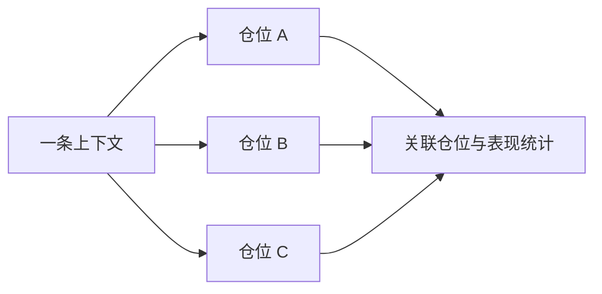

## 上下文是什么

上下文是可以被多笔仓位重复引用的独立记录。新闻、关键位、市场分析和 Confluence 都属于上下文；仓位里的 `笔记` 则只属于当前这一笔交易。

上下文重要，是因为同一事件、价格区域或判断可能影响多笔交易。独立保存后，LucrJournal 能从上下文反向找到关联仓位，并汇总这些仓位的表现。

例如，一次利率决议同时影响三笔仓位时，可以建立一条新闻，让三笔仓位都关联它，而不是复制三份事件说明。

上下文与仓位、策略手册和复盘统计相关。仓位保存链接，上下文保留可复用内容，统计再沿链接反向汇总。

## 什么时候独立，什么时候写在仓位里

判断标准不是内容长短，而是它是否有独立身份、是否会被复用。

| 内容 | 放在哪里 | 原因 |
| --- | --- | --- |
| 这笔交易为什么入场 | 当前仓位的 `笔记` | 只解释这一笔。 |
| 这笔交易执行时发生了什么 | 当前仓位的 `笔记` | 属于单次执行过程。 |
| 一个事件影响多笔交易 | 新闻 | 事件需要被重复引用。 |
| 一个价格区域被反复观察 | 关键位 | 价格区域有独立身份。 |
| 一段市场判断会持续用于后续交易 | 市场分析 | 判断跨越多笔仓位。 |
| 一组条件反复共同出现 | Confluence | 条件组合需要关联策略手册和仓位。 |

> [!TIP]
> 第一次出现、还不确定会不会复用时，先写在仓位的 `笔记`。第二次需要引用时，再把稳定的部分整理成独立上下文。

## 新闻

新闻是有独立名称、可选来源和正文的事件记录。它适合保存会影响一笔以上仓位的外部信息。

新闻重要，是因为同一事件不需要在每笔仓位中重复复制，事件来源也能保留在一份记录里。

例如，把“美国 CPI 2026-07”保存为新闻，再关联当日的指数、黄金和外汇仓位。每笔仓位的 `笔记` 仍然记录自己如何应对这条消息。

新闻与仓位的 News 分区和 `关联仓位` 统计相关。从仓位里只输入名称创建新闻时，插件会把来源留空，并创建空正文，等你之后补充。

## 关键位

关键位是可以被多笔仓位引用的价格区域记录。它表示“哪些交易都在观察同一个位置”，而不是解释某一笔的执行细节。

关键位重要，是因为同一区域可能跨时间、跨方向影响多笔交易。独立记录后，你能回看围绕它发生过哪些仓位。

例如，把“纳指前高 21,500”保存为关键位。第一次突破和后来的回踩可以分别记录为仓位，并共同关联这个关键位。

关键位与仓位的 Key Levels 分区和反向表现统计相关。从仓位里只输入名称创建时，`描述` 默认为空。

## 市场分析

市场分析是可以持续引用的一段市场判断。它保存你的结构、趋势或环境结论，不等同于某一笔仓位的入场理由。

市场分析重要，是因为同一个判断可能在数天内影响多笔交易。把判断独立出来，复盘时才能比较它与后续结果是否一致。

例如，把“美元走强，风险资产承压”保存为市场分析，再关联这段时间内受该判断影响的仓位。每笔仓位仍在 `笔记` 中记录自己的执行差异。

市场分析与仓位的 Market Analysis 分区和反向表现统计相关。从仓位里只输入名称创建时，`描述` 默认为空。

## Confluence

Confluence 是一组共同出现、可以复用的条件组合。它把多个条件收成一个有名字的模式，供仓位和策略手册引用。

Confluence 重要，是因为单个条件通常不足以描述一类交易形态。条件组合有了独立身份后，才能比较它在不同仓位中的表现。

例如，“回踩周线关键位 + 趋势方向一致 + 放量确认”可以保存为一条 Confluence，再放进策略手册的某个条件分组，并关联实际仓位。

Confluence 与条件、策略手册和仓位相关。它还分为两种可见范围：

- 从仓位创建的 Confluence 默认 `公开`，会出现在 Confluence 列表，也能被未关联策略手册的仓位选择。
- 策略手册保存时自动补建的 Confluence 不公开，不出现在公开列表中，但仍能在策略手册中使用。
- 仓位关联某个策略手册后，可以看到该策略手册所引用的不公开 Confluence。
- 策略手册选择 Confluence 时，可以看到公开和不公开两类条目。

![[screenshot-confluence.png]]

> [!NOTE]
> 可见范围只控制条目出现在哪些选择列表中，不代表仓位内容的访问权限。它用于把通用 Confluence 与某个策略手册内部使用的 Confluence 分开。

## 反向统计怎样计算

反向统计是 LucrJournal 根据真实文件链接，从一条上下文回看关联仓位的结果。它不是手动填写的汇总。

统计重要，是因为“关联了多少笔”和“哪些仓位参与表现”使用两套口径：

- `关联仓位` 和 `交易笔数` 包含所有能通过链接解析到这条上下文的仓位，包括持仓中的仓位。
- `胜率`、`净利润`、`最大盈利` 和 `最大亏损` 只使用已平仓且净利润为非零数字的仓位。
- 没有符合表现口径的仓位时，胜率是 0，最大盈利和最大亏损没有数值。

例如，一条市场分析关联了 5 笔仓位，其中 2 笔仍在持仓，1 笔已平仓但净利润为 0，另外 2 笔已平仓且净利润非零。页面会把交易笔数记为 5，但胜率和盈亏表现只由最后 2 笔决定。

这套口径也用于策略手册表现。仓位是否算作已平仓，由 `状态` 或 `平仓时间` 共同判断，见 [[position-lifecycle]]。

## 移除关联与删除原条目

从一笔仓位中 `移除` 上下文，只会去掉当前仓位中的链接，不会删除原始上下文文件，也不会影响其他仓位。

从 `分析` 中删除原始上下文则不同。插件会先清理所有关联仓位中指向它的上下文链接，再把源文件移入回收站。

> [!WARNING]
> 删除 Confluence 时，插件不会同步改写策略手册正文。仍引用它的策略手册可能留下断开的链接。删除前先检查它是否仍在策略手册中使用。

## 继续阅读

- [[position-details]]：在单笔仓位里添加和移除上下文。
- [[playbooks-and-criteria]]：理解策略手册、条件和 Confluence 的关系。
- [[dashboard-review]]：从反向统计回看交易表现。
