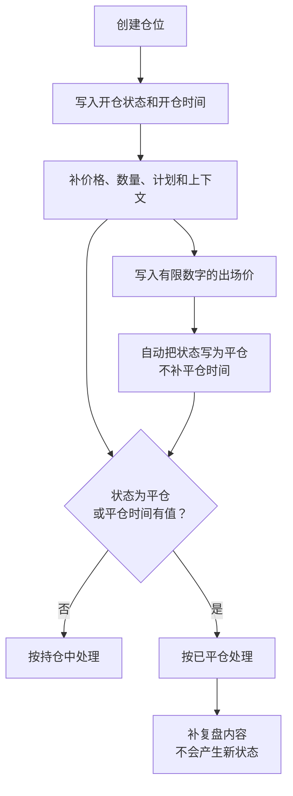

## 生命周期不是单一状态机

仓位生命周期是 `状态`、`开仓时间`、`平仓时间` 和 `出场价` 等字段共同形成的实际阶段。它不是由一个枚举完整控制的状态机。

这一点重要，是因为 LucrJournal 允许这些字段分别为空，也允许它们暂时不一致。系统判断一笔仓位是否已平仓时，只检查两个条件：`状态` 为 `平仓`，或 `平仓时间` 有值。任一条件满足，就按已平仓处理。

例如，一笔仓位写入了 `出场价`，插件会把 `状态` 改为 `平仓`，但不会自动填写 `平仓时间`。它已经算作已平仓，持仓时长却仍缺少结束时间。

## 创建阶段

创建阶段是仓位通过 `保存仓位` 第一次写入文件的时刻。正常创建入口会写入：

- `状态` 为 `开仓`。
- `开仓时间` 为当前设置时区的时间。
- 创建时选择的 `方向`。
- 空的 `置信度`、`名义价值`、`风险` 和 `手续费`。
- 初始 `净利润` 为 0。
- 一个空的 `笔记` 分区。

这些空值很重要。它们表示信息尚未补齐，不表示插件已经算出结果为 0。

例如，你可以只选择账户、标的和 `做多`，先保存仓位。此时它已经有稳定身份和开仓时间，价格、数量与计划可以随后补充。

创建阶段与账户、标的直接相关。插件会先确认账户存在，再确保该账户下有对应标的，最后让仓位链接标的。完整关系见 [[account-symbol-position]]。

> [!NOTE]
> `方向` 在创建后不能修改。后续更新只要触及方向，插件就会拒绝整次修改。创建时选错方向，需要重新建立正确的仓位记录。

## 持仓阶段

持仓阶段是仓位尚未满足“状态为平仓或平仓时间有值”这一判断的阶段。这里最有意义的是执行事实、仓位规模和交易计划。

| 字段 | 在这一阶段的意义 | 相关结果 |
| --- | --- | --- |
| `标的` | 决定账户归属、类型、手续费和合约单位。 | 数量语义、名义价值、手续费。 |
| `方向` | 决定价格变化的正负方向。 | 风险、计划 R:R、实际 R:R、净利润。 |
| `入场价` | 公式使用的唯一入场价格。 | 名义价值、风险与结果。 |
| `数量`、`合约` 或 `手数` | 按标的类型表示仓位规模。 | 名义价值。 |
| `止损` | 表示计划承担的价格距离。 | 风险、计划 R:R、实际 R:R。 |
| `目标价` | 表示计划获得的价格距离。 | 计划 R:R。 |
| `置信度` | 保存你对这笔交易的主观评分。 | 复盘筛选，不改变公式。 |

例如，一笔 `做多` 仓位补入场价、数量和止损后，插件可以派生名义价值与风险；再补目标价后，才能派生计划 R:R。缺少任一必要输入时，对应结果没有可靠含义。

这些字段与标的类型直接相关。`数量`、`合约` 和 `手数` 不能互换，见 [[symbol-types]]。

## 平仓阶段

平仓阶段是 LucrJournal 已把仓位判断为结束的阶段。触发条件是 `状态` 为 `平仓`，或 `平仓时间` 有值。

平仓重要，是因为反向统计会把它作为表现样本的第一道条件。仅有持仓记录不会进入胜率、净利润、最大盈利和最大亏损的计算。

写入一个可转换为有限数字的 `出场价` 时，插件会自动把 `状态` 写为 `平仓`，但不会自动补 `平仓时间`。反过来，只填写 `平仓时间` 也足以让仓位被视为已平仓，即使 `状态` 仍是 `开仓`。

> [!WARNING]
> `出场价`、`状态` 和 `平仓时间` 不是一组强制同步字段。写入 0 或负数出场价也会触发平仓，清空出场价不会自动重新开仓。平仓后应同时核对这三个字段。

平仓后，各结果需要的输入并不相同：

- `净利润` 需要方向、入场价、出场价、名义价值，并扣除手续费。公式只使用一份入场价，不计算平均入场价。
- `实际 R:R` 需要方向、入场价、出场价和止损。它重新按源字段计算，不读取已保存的净利润或风险，也不计手续费。
- `持仓时长` 需要开仓时间和平仓时间。只有状态或出场价不足以得到完整时长。

例如，一笔 `做多` 仓位入场价 100，名义价值 1,000，出场价 110，手续费 2，净利润是 98。止损为 95 时，实际 R:R 是 2；这个 R:R 不会因为手续费变成 98 而改变。

平仓阶段与上下文和策略手册统计相关。已平仓还不够，净利润必须是非零数字，仓位才会进入这些反向表现指标。具体口径见 [[context-notes#反向统计怎样计算]]。

## 重新开仓

重新开仓是显式把 `状态` 改回 `开仓`。如果同一次修改没有同时提供 `平仓时间`，插件会清空原有平仓时间。

这个行为重要，是因为清空 `出场价` 本身不会重新开仓；反过来，只改状态也不会自动清空旧的出场价。

例如，一笔仓位误填出场价后，先清空出场价，状态仍可能保持平仓。显式改回开仓后，插件会在没有同时提交平仓时间时清空平仓时间，但旧出场价是否保留仍取决于你有没有单独清除它。

重新开仓与 `状态`、`平仓时间` 和 `出场价` 相关。它不会改变创建时固定的方向，也不会创建一条新的仓位记录。

## 复盘结束

复盘结束是内容完整度，不是 LucrJournal 的第三种仓位状态。插件只有开仓与平仓值，没有“已复盘”状态。

这个边界重要，是因为补完 `置信度`、`笔记`、新闻、关键位、市场分析、Confluence 或策略手册，都不会触发新的生命周期转移。你需要根据记录是否足以回答复盘问题，自己判断是否完成。

例如，一笔已平仓仓位补齐执行事实、截图、原始笔记、相关上下文和策略手册后，可以视为复盘结束；它在系统里仍然只是已平仓仓位。

复盘阶段与 [[context-notes]]、[[attachments-chart-ocr]] 和 [[playbooks-and-criteria]] 相关。这些内容补充“为什么”和“学到了什么”，不改变仓位的开平判断。

![[screenshot-position-detail-crypto-overview.png]]

## 派生值的更新边界

名义价值、手续费、净利润和风险是由源字段触发重算的派生值。修改相关价格、数量或标的时，插件会按当前输入尝试更新它们；直接修改派生值则会保留手动结果，直到后续源字段变化再次覆盖。

> [!WARNING]
> 清空或改坏数量、入场价、合约单位等输入，使公式无法得到新结果时，旧的名义价值不会自动清空。标的手续费被清空、无效或算得 0 时，旧手续费也可能继续参与净利润。移除源数据后要重新核对 `名义价值`、`手续费`、`净利润` 和 `风险`。

## 删除不是生命周期状态

删除仓位会把当前仓位文件移入回收站，它不是一次平仓或复盘转移。账户、标的、策略手册和上下文文件不会随这次直接删除一起移除。

> [!WARNING]
> 直接删除仓位不会清理它独占的附件，附件可能留在 Vault 中而不再被仓位引用。需要保留统计或证据时，不要把删除当作“结束复盘”。

## 继续阅读

- [[record-first-position]]：创建一笔正式仓位。
- [[position-details]]：补全执行、时间、风险与上下文。
- [[review-workflow]]：把已平仓记录整理成可复用结论。
